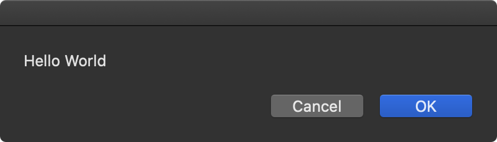

# Hello World

create file `hello-world.applescript`

```
display dialog "Hello World"
```

use `osacompile` to compile .applescript to app

```
$ osacompile -o hello-world.app hello-world.applescript

$ ls -l
drwxr-xr-x  3 supasin  staff   96 Feb  1 09:08 hello-world.app
-rw-r--r--@ 1 supasin  staff   29 Feb  1 09:05 hello-world.applescript
```

run `hello-world.app`


