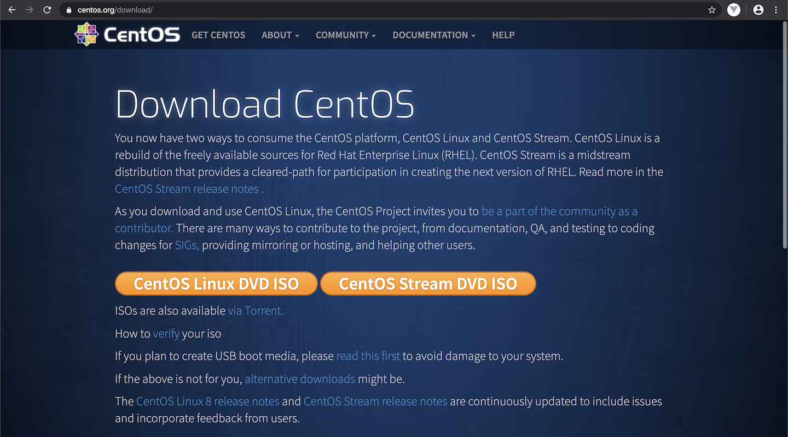
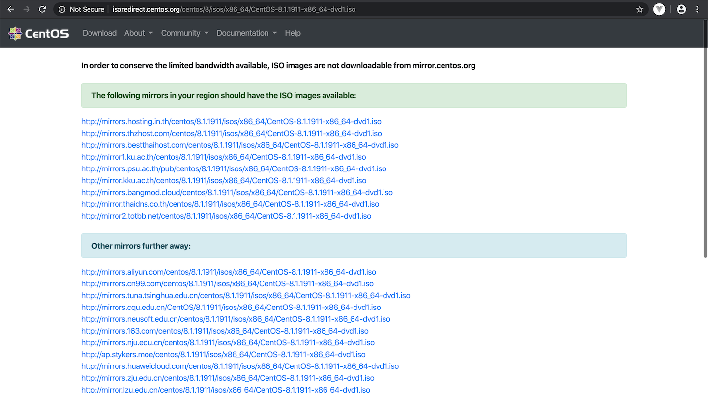
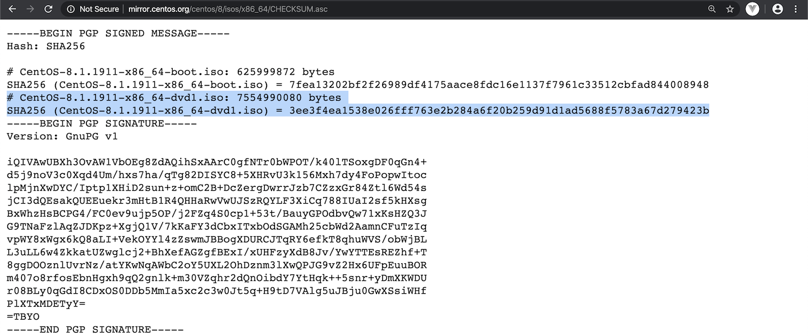

# ดาวน์โหลดไฟล์ ISO image

เริ่มต้นเข้าเว็บไซต์ [https://www.centos.org/download/](https://www.centos.org/download/)



คลิกปุ่ม `CentOS Linux DVD ISO`

หน้าเว็บไซต์จะแสดงรายชื่อ mirror หรือเว็บไซต์ต่างๆ ที่สามารถดาวน์โหลดไฟล์ ISO image ได้



คลิกลิงก์ไหนก็ได้ ที่น่าจะอยู่ใกล้กับคุณที่สุด เพื่อดาวน์โหลดไฟล์

ตัวอย่างไฟล์ที่ดาวน์โหลดได้

```console
$ ls -lh CentOS-8.1.1911-x86_64-dvd1.iso
-rw-r--r--@ 1 supasin  staff   7.0G Jan 23 23:52 CentOS-8.1.1911-x86_64-dvd1.iso
```

## ตรวจสอบความถูกต้องของไฟล์ (CHECKSUM)

เพื่อตรวจสอบว่าไฟล์ที่ดาวน์โหลดมาครบถ้วน ถูกต้อง ไม่ถูกดัดแปลงแก้ไขจากผู้ไม่ประสงค์ดี แนะนำให้ตรวจสอบ CHECKSUM ของไฟล์ โดยเทียบกับ CHECKSUM จาก [http://mirror.centos.org/centos/8/isos/x86_64/CHECKSUM.asc](http://mirror.centos.org/centos/8/isos/x86_64/CHECKSUM.asc)

ตัวอย่างข้อมูล CHECKSUM ของ CentOS Linux 8.1



ตัวอย่างการใช้คำสั่ง `shasum` ระบุออปชัน `-a 256` บน MacOS เพื่อตรวจสอบความถูกต้องของไฟล์ด้วย SHA256

```console
$ shasum -a 256 CentOS-8.1.1911-x86_64-dvd1.iso
3ee3f4ea1538e026fff763e2b284a6f20b259d91d1ad5688f5783a67d279423b  CentOS-8.1.1911-x86_64-dvd1.iso
```

ผลลัพธ์ที่ได้ต้องตรงกับข้อมูลจากลิงก์ด้านบน
