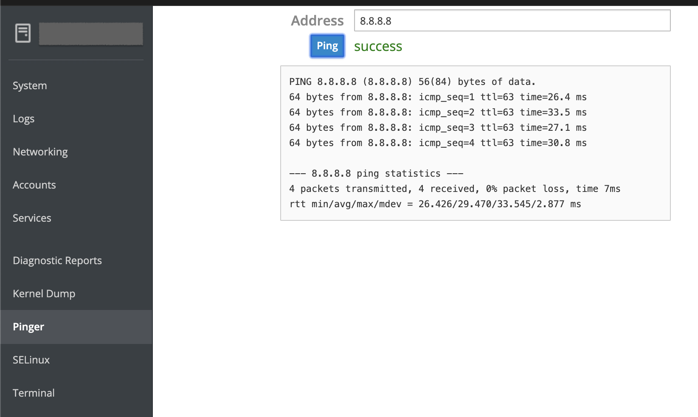

# pinger

```console
$ mkdir -p ~/.local/share/cockpit/pinger

$ cd ~/.local/share/cockpit/pinger/
```

$ vi manifest.json

```json
{
    "version": 0,

    "tools": {
        "pinger": {
            "label": "Pinger",
            "path": "pinger.html"
        }
    }
}
```

$ vi pinger.html

```html
<head>
    <title>Pinger</title>
    <meta charset="utf-8">
    <link href="../base1/cockpit.css" type="text/css" rel="stylesheet">
    <script src="../base1/cockpit.js"></script>
</head>
<body>
    <div class="container-fluid">
        <table class="form-table-ct">
            <tr>
                <td><label class="control-label" for="address">Address</label></td>
                <td><input class="form-control" id="address" value="8.8.8.8"></td>
            </tr>
            <tr>
                <td><button class="btn btn-default btn-primary" id="ping">Ping</button></td>
                <td><span id="result"></span></td>
            </tr>
        </table>
        <p>
            <pre id="output"></pre>
        </p>
    </div>

    <script src="pinger.js"></script>
</body>
</html>
```

$ vi pinger.js

```javascript
var address = document.getElementById("address");
var output = document.getElementById("output");
var result = document.getElementById("result");

document.querySelector(".container-fluid").style["max-width"] = "500px";
document.getElementById("ping").addEventListener("click", ping_run);

function ping_run() {
    var proc = cockpit.spawn(["ping", "-c", "4", address.value]);
    proc.done(ping_success);
    proc.stream(ping_output);
    proc.fail(ping_fail);

    result.innerHTML = "";
    output.innerHTML = "";
}

function ping_success() {
    result.style.color = "green";
    result.innerHTML = "success";
}

function ping_fail() {
    result.style.color = "red";
    result.innerHTML = "fail";
}

function ping_output(data) {
    output.append(document.createTextNode(data));
}

// Send a 'init' message.  This tells the tests that we are ready to go
cockpit.transport.wait(function() { });
```

```console
$ cockpit-bridge --packages
base1: /usr/share/cockpit/base1
domain: /usr/share/cockpit/realmd
kdump: /usr/share/cockpit/kdump
network: /usr/share/cockpit/networkmanager
performance: /usr/share/cockpit/tuned
pinger: /home/supasin/.local/share/cockpit/pinger
selinux: /usr/share/cockpit/selinux
shell: /usr/share/cockpit/shell
sosreport: /usr/share/cockpit/sosreport
ssh: /usr/share/cockpit/ssh
system: /usr/share/cockpit/systemd
users: /usr/share/cockpit/users
```

## web

https://localhost:9090


