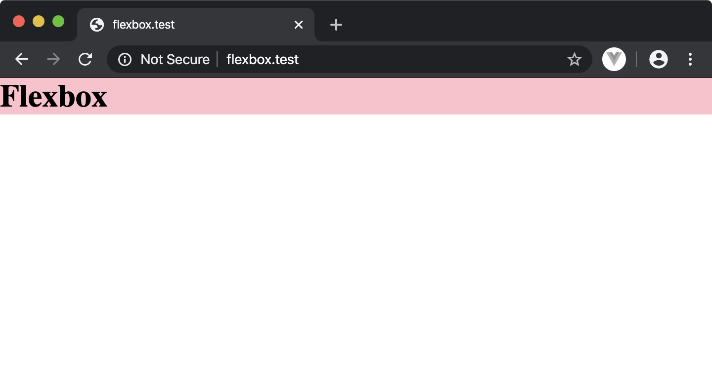
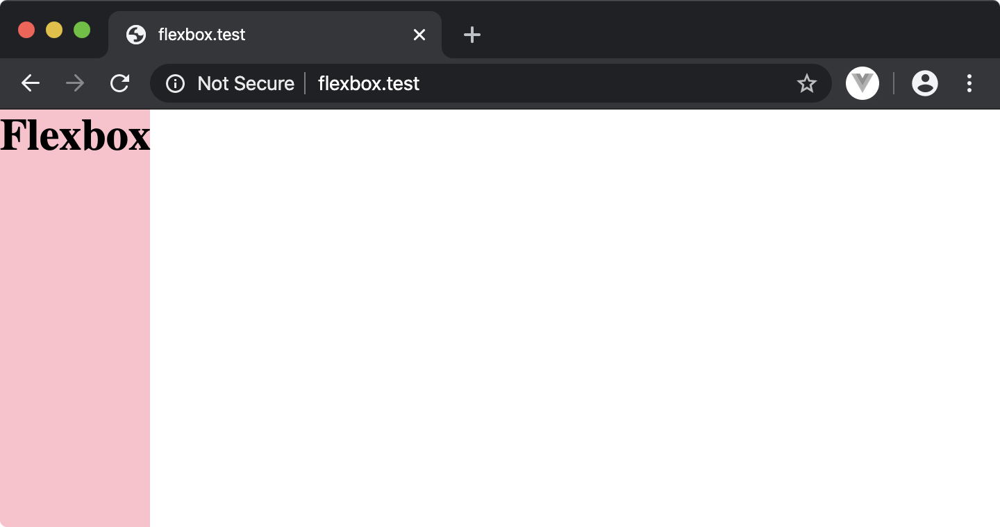
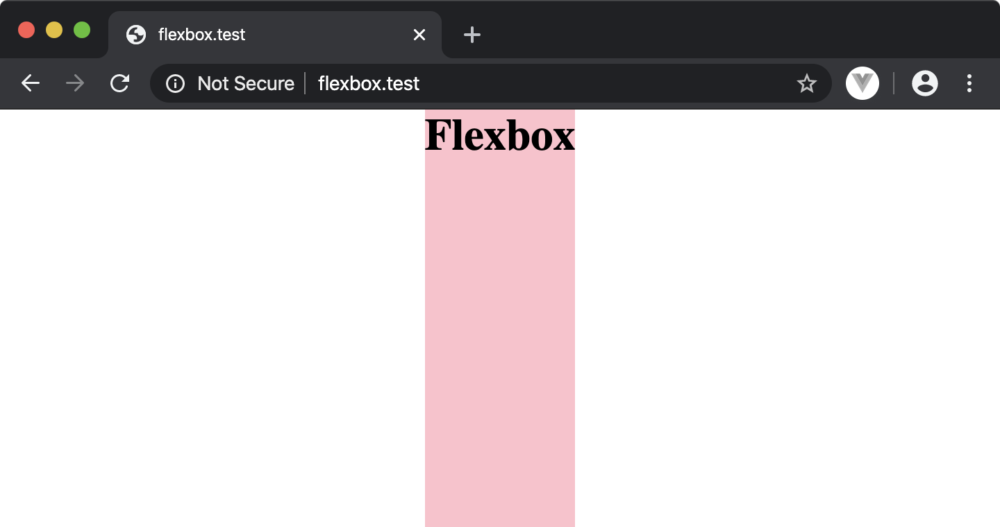
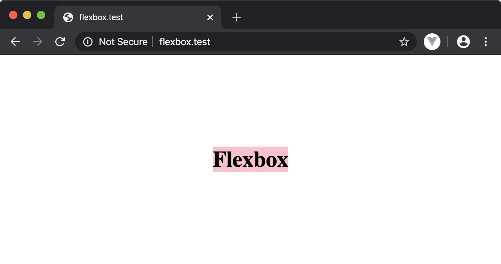
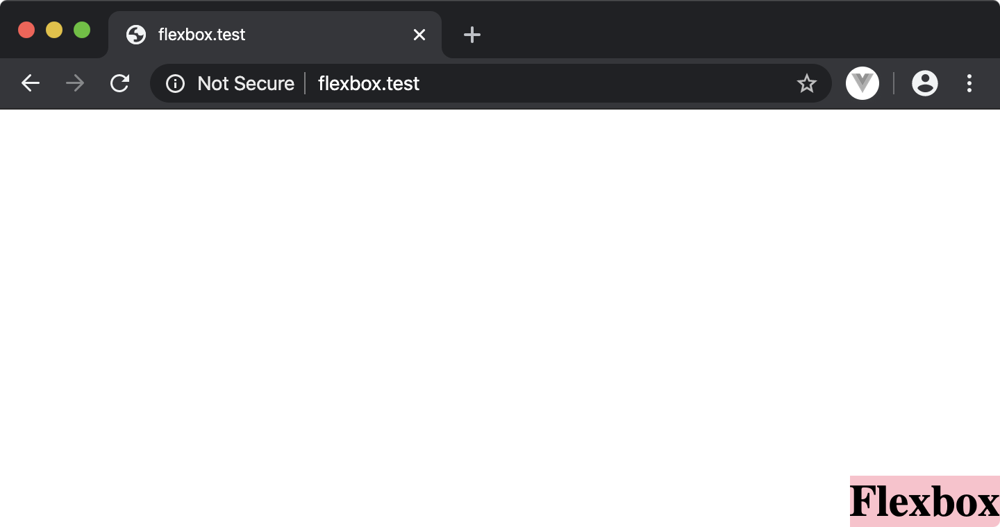

# หัดใช้ Flexbox เบื้องต้น

ปัญหาอย่างหนึ่งของการเขียนเว็บคือการกำหนดลักษณะการวางข้อมูลให้อยู่ในตำแหน่งที่เราต้องการ เช่นอยู่ตรงกึ่งกลาง หรือชิดขวา

ลองมาดูวิธีการใช้ Flexbox เพื่อกำหนดลักษณะการวางกัน

สร้างไฟล์ `index.html` ซึ่งประกอบด้วย `<h1>` ที่เราต้องการจัดวาง ให้อยู่ในตำแหน่งที่ต้องการ

```html
<!DOCTYPE html>
<html>
<head>
    <meta charset="utf-8">
    <link rel="stylesheet" href="style.css">
</head>
<body>
    <h1>Flexbox</h1>
</body>
</html>
```

โดยไฟล์ `index.html` จะใช้ไฟล์ `style.css` เพื่อกำหนด stylesheet

ตัวอย่างไฟล์ `style.css` เริ่มต้น

```css
* {
    margin: 0;
}

h1 {
    background-color: #ccc;
}
```

ทดลองเปิดด้วย browser 



## display: flex

แก้ไขไฟล์  `style.css` โดยกำหนดให้แสดงผลเต็มความสูง `height: 100%` ของ browser และกำหนดให้ `<body>` แสดงผลในรูปแบบ `flex` เพื่อใช้กำหนดตำแหน่งของ `<h1>`

ไฟล์  `style.css` หลังจากแก้ไข

```css
* {
    margin: 0;
}

h1 {
    background-color: #ccc;
}

body, html {
    height: 100%;
}

body {
    display: flex;
}
```

ตัวอย่างหน้าจอ หลังจากกำหนดการแสดงผล `<body>` ให้เป็นแบบ `display: flex`



## justify-content

แก้ไขไฟล์ `style.css` โดยเพิ่ม `justify-content` เพื่อกำหนดลักษณะการวางข้อมูลในแกนหลัก *Main Axis* ภายในพื้นที่ที่เรากำหนดเป็น flex เช่นเราต้องการวาง `<h1>` ให้อยู่ตรงกลางของ `<body>` ที่เรากำหนดให้แสดงผลเป็นแบบ `flex` แล้ว

โดยดีฟอลต์ การทิศทางการวางข้อมูล `flow-direction` ในแกนหลักจะเป็นรูปแบบ `row` ทำให้ เวลาเรากำหนดค่า `justify-content` จะมีผลต่อการแสดงผลใน `row` หรือ *X-Axis* เช่นในที่นี้เรากำหนดการแสดงให้อยู่ตรงกลาง `center` ทำให้ข้อความ `<h1>` แสดงผลอยู่กึ่งกลางหน้าจอ

```css
// ...
body {
    display: flex;
    justify-content: center;
}
```

ตัวอย่างหน้าจอ หลังจากการกำหนด `justify-content: center`



## align-items

ส่วนการวางข้อมูลในแกนตั้ง *Y-Axis* ในที่นี้เราสามารถกำหนดโดย กำหนดการวางข้อมูลของ *แกนรอง* หรือ *Cross Axis* ด้วยการกำหนดใน `align-items`

เช่นถ้าเราต้องการกำหนดให้อยู่กึ่งกลาง ตามแถวตั้ง ก็สามารถทำได้โดยแก้ไขไฟล์ `style.css`

```css
// ...
body {
    display: flex;
    justify-content: center;
    align-items: center;
}
```

ตัวอย่างหน้าจอ หลังจากเพิ่ม `align-items: center`



## flex-end

นอกจากนี้ เราสามารถกำหนดลักษณะการวาง ในรูปแบบอื่นๆ ได้อีกด้วย เช่นต้องการให้ข้อความแสดงอยู่ที่ด้าน *ขวา-ล่าง* ของหน้าจอ ก็สามารถเปลี่ยนลักษณะการวางของทั้ง `justify-content` และ `align-items` ให้เป็น `flex-end`

ตัวอย่างไฟล์ `style.css` เพื่อกำหนดให้ข้อความแสดงอยู่ที่ด้าน *ขวา-ล่าง* ของหน้าจอ

```css
// ..
body {
    display: flex;
    justify-content: flex-end;
    align-items: flex-end;
}
```

ตัวอย่างหน้าจอแสดงผล หลังจากกำหนดการวางเป็นแบบ `flex-end`



## ข้อมูลเพิ่มเติม
- [Learn Flexbox Through Examples](https://laracasts.com/series/learn-flexbox-through-examples)
