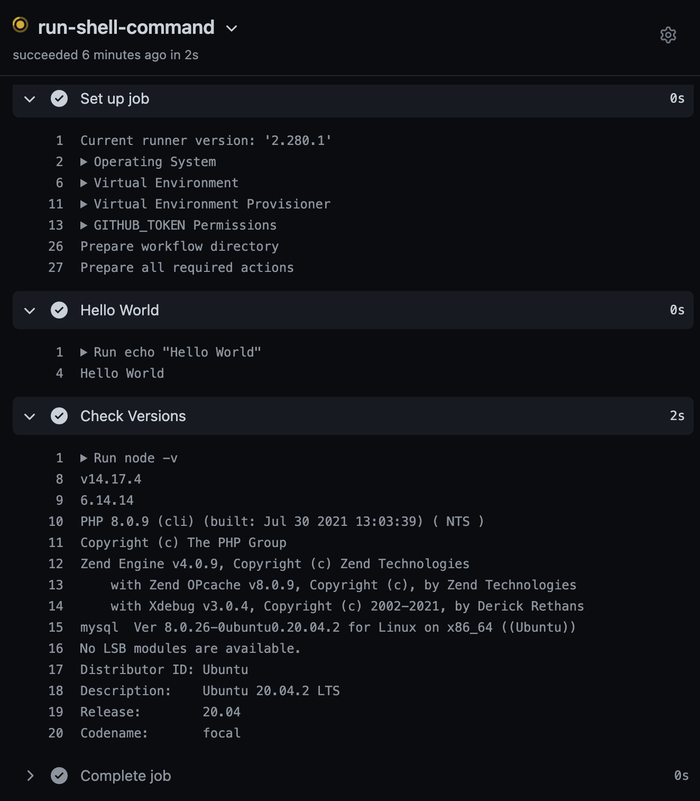

# GitHub Actions

Create `.github/workflows`

```
$ mkdir -p .github/workflows
```

Create `.github/workflows/simply.yml`

```
# .github/workflows/simply.yml`
name: Test Shell Commands
on: [push]
jobs:
  run-shell-command:
    runs-on: ubuntu-latest
    steps:
      - name: Hello World
        run: echo "Hello World"
      - name: Check Versions
        run: |
          node -v
          npm -v
          php -v
          mysql -V
          lsb_release -a
```

```
$ git add .
$ git commit -m 'Add yml'
$ git push
```



