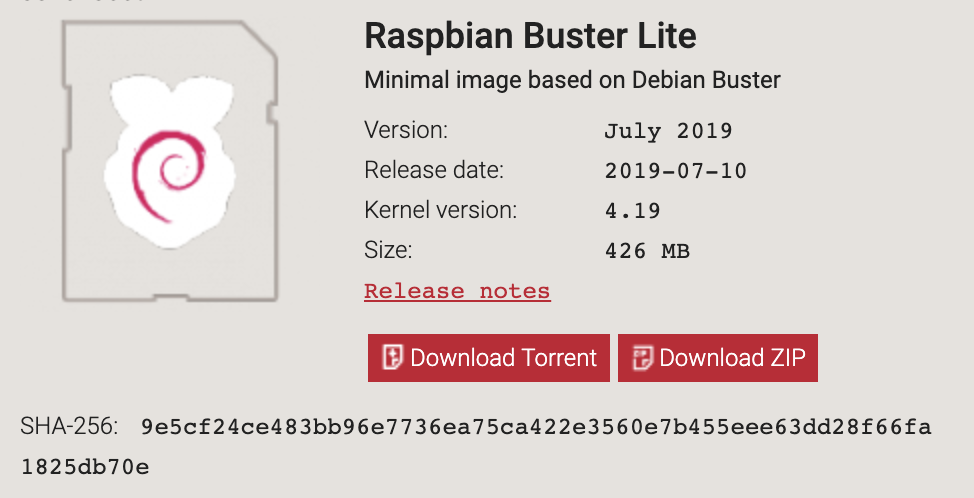

# Raspbian image

## Download the image

Download Raspbian from https://www.raspberrypi.org/downloads/raspbian/

Example downloaded file for Raspbian Buster Lite Version: July 2019

```console
$ ls -lh
total 832528
-rw-r--r--@ 1 supasin  staff   407M Aug  2 06:42 2019-07-10-raspbian-buster-lite.zip
```

## Checksum

Run checksum command and verify with the value on web site

Example: checksum for Raspbian Buster Lite Version: July 2019 on web site



SHA-256: 9e5cf24ce483bb96e7736ea75ca422e3560e7b455eee63dd28f66fa1825db70e

On MacOS

```console
$ shasum -a 256 2019-07-10-raspbian-buster-lite.zip
9e5cf24ce483bb96e7736ea75ca422e3560e7b455eee63dd28f66fa1825db70e  2019-07-10-raspbian-buster-lite.zip
```

## Unzip file

```console
$ unzip 2019-07-10-raspbian-buster-lite.zip
Archive:  2019-07-10-raspbian-buster-lite.zip
  inflating: 2019-07-10-raspbian-buster-lite.img

$ ls -lh
total 5132944
-rw-r--r--@ 1 supasin  staff   2.0G Jul 10 07:21 2019-07-10-raspbian-buster-lite.img
-rw-r--r--@ 1 supasin  staff   407M Aug  2 06:42 2019-07-10-raspbian-buster-lite.zip
```

## Write image to SD card

Insert SD Card

```console
$ diskutil list

/dev/disk2 (internal, physical):
   #:                       TYPE NAME                    SIZE       IDENTIFIER
   0:     FDisk_partition_scheme                        *15.9 GB    disk2
```

unmount the card

```console
$ diskutil unmountDisk /dev/disk2
Unmount of all volumes on disk2 was successful
```

Use dd command to write image to SD card, (take about 10 minutes)

```console
$ sudo dd bs=1m if=2019-07-10-raspbian-buster-lite.img of=/dev/disk2
2096+0 records in
2096+0 records out
2197815296 bytes transferred in 606.278478 secs (3625092 bytes/sec)
```

eject the card

```console
$ diskutil eject /dev/disk2
Disk /dev/disk2 ejected
```

Insert SD card to Pi, and power up.

Login prompt after boot success.

```
Raspbian GNU/Linux 10 raspberrypi tty1

raspberrypi login: pi
Password:

Linux raspberrypi 4.19.57-v7+ #1244 SMP Thu Jul 4 18:45:25 BST 2019 armv7l

The programs included with the Debian GNU/Linux system are free software;
the exact distribution terms for each program are described in the
individual files in /usr/share/doc/*/copyright.

Debian GNU/Linux comes with ABSOLUTELY NO WARRANTY, to the extent
permitted by applicable law.

pi@raspberrypi:~ $
```
