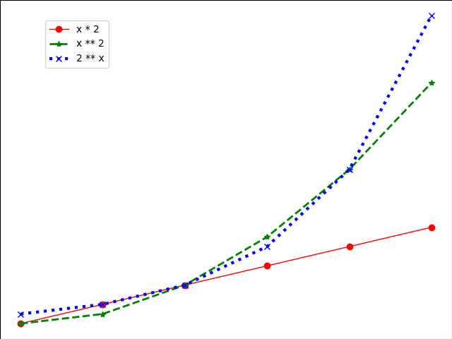

# Matplotlib

```python
import numpy as np
import matplotlib.pyplot as plt

x = np.linspace(0, 5, 6)
# [0. 1. 2. 3. 4. 5.]

fig = plt.figure()
ax = fig.add_axes([0, 0, 1, 1])

ax.plot(x, x * 2, color='red', lw=1, label='x * 2', marker='o')
ax.plot(x, x ** 2, color='green', lw=2, label='x ** 2', marker='*', ls='--')
ax.plot(x, 2 ** x, color='blue', lw=3, label='2 ** x', marker='x', ls=':')

ax.legend(loc=(0.1, 0.8))
ax.set_title('title')
ax.set_xlabel('x')
ax.set_ylabel('y')
# ax.set_xlim(0, 6)
# ax.set_ylim(0, 35)

# plt.show()
plt.savefig('matplotlib-output.png')
```


