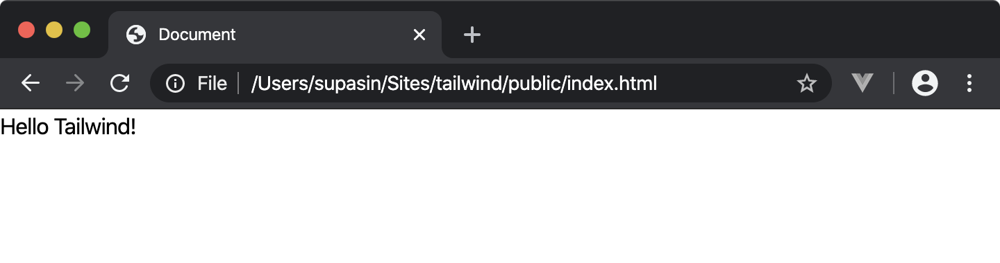
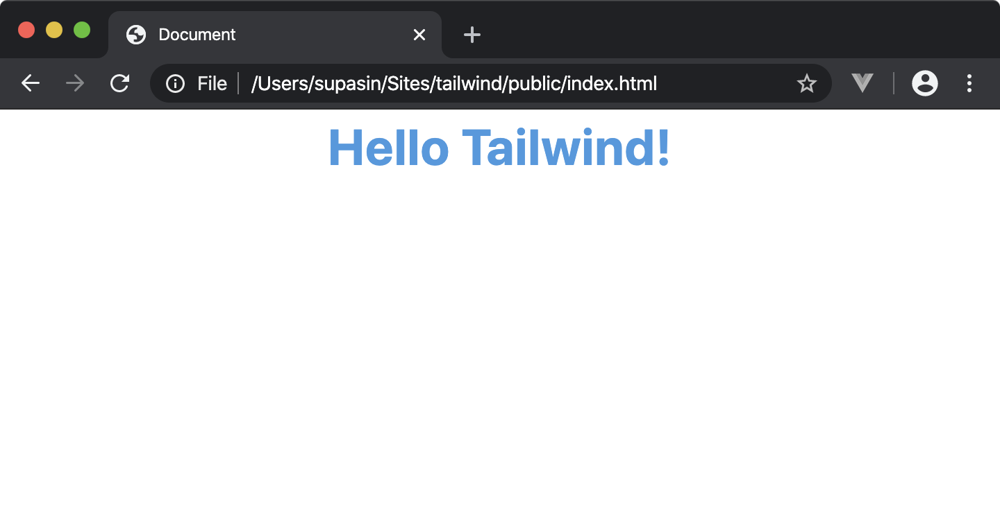

# ติดตั้ง เซ็ตอัพ และทดลองใช้งาน tailwind เบื้องต้น

ลองมาดูวิธีการติดตั้ง เซ็ตอัพ และทดลองใช้งาน tailwind เบื้องต้นกัน

## ติดตั้ง tailwind และแพ็คเกจที่เกี่ยวข้อง

สร้างโฟลเดอร์ สำหรับทดสอบ 

```console
$ cd ~/Sites/
$ mkdir tailwind
$ cd tailwind
```

เริ่มต้นสร้างไฟล์ package.json

```console
$ npm init -y
Wrote to /Users/supasin/Sites/tailwind/package.json:

{
  "name": "tailwind",
  "version": "1.0.0",
  "description": "",
  "main": "index.js",
  "scripts": {
    "test": "echo \"Error: no test specified\" && exit 1"
  },
  "keywords": [],
  "author": "",
  "license": "ISC"
}
```

ใช้คำสั่ง npm install ติดตั้ง tailwind และแพ็คเกจอื่นๆ ที่ใช้ในการรันและประมวลผล css

```console
$ npm install tailwindcss postcss-cli autoprefixer
```

## เซ็ตอัพ tailwind เบื้องต้น

รันคำสั่ง `npx tailwind init` เพื่อสร้างไฟล์คอนฟิกของ tailwind สำหรับใช้ในการปรับแต่งค่าต่างๆ

```console
$ npx tailwind init

   tailwindcss 1.2.0

   ✅ Created Tailwind config file: tailwind.config.js
```

สร้างไฟล์ `postcss.config.js` เพื่อใช้กำหนดปลั๊กอิน (css plugins) ที่เราจะใช้

```console
$ vi postcss.config.js
module.exports = {
  plugins: [
    require('tailwindcss'),
    require('autoprefixer'),
  ]
}
```

สร้างไฟล์ tailwind.css ไว้ในโฟลเดอร์ย่อย css/

```console
$ mkdir css

$ vi css/tailwind.css
@tailwind base;
@tailwind components;
@tailwind utilities;
```

แก้ไขไฟล์ package.json โดยภายใต้ `scripts` เพิ่มคำสั่ง `build` เพื่อใช้ในการประมวลผลไฟล์ `tailwind.css`

```console
$ vi package.json
  ...
  "scripts": {
    "build": "postcss css/tailwind.css -o public/build/tailwind.css"
  },
  ...
```

ใช้คำสั่ง `npm` ระบุออปชัน `run` เพื่อรันคำสั่ง `build` ที่ถูกกำหนดไว้ภายใต้ `script` ในไฟล์ `package.json`

```console
$ npm run build

> tailwind@1.0.0 build /Users/supasin/Sites/tailwind
> postcss css/tailwind.css -o public/build/tailwind.css
```

ผลลัพธ์ที่ได้จากการรันคำสั่ง `npm run build` จะถูกเก็บไว้ในไฟล์ `public/build/tailwind.css`

```console
$ ls -l public/build/tailwind.css
-rw-r--r--  1 supasin  staff  1090219 Feb  8 11:12 public/build/tailwind.css
```

## ทดลองใช้งาน tailwind เบื้องต้น

สร้างไฟล์ `index.html` ไว้ในโฟลเดอร์ `public/` เพื่อทดสอบการแสดงผล โดยใช้ tailwind เป็น css stylesheet

```html
<html lang="en">
<head>
  <meta charset="UTF-8">
  <meta name="viewport" content="width=device-width, initial-scale=1.0">
  <meta http-equiv="X-UA-Compatible" content="ie=edge">
  <title>Document</title>
  <link rel="stylesheet" href="build/tailwind.css">
</head>
<body>
  <h1>
    Hello Tailwind!
  </h1>
</body>
</html>
```

ตัวอย่างผลลัพธ์ของไฟล์ index.html ที่เปิดใน browser



ลองแก้ไข `<h1>` ในไฟล์ index.html โดยเพิ่ม class เพื่อกำหนดลักษณะของตัวอักษรโดยใช้ tailwind

```html
  ...
  <h1 class="text-4xl font-bold text-center text-blue-500">
    Hello Tailwind!
  </h1>
  ...
```

ลองรีเฟรชใน browser เพื่อเปิดไฟล์ index.html อีกครั้ง

ตัวอย่างของผลลัพธ์ที่ได้



## ข้อมูลเพิ่มเติม
- [Setting up Tailwind and PostCSS](https://tailwindcss.com/course/setting-up-tailwind-and-postcss)
