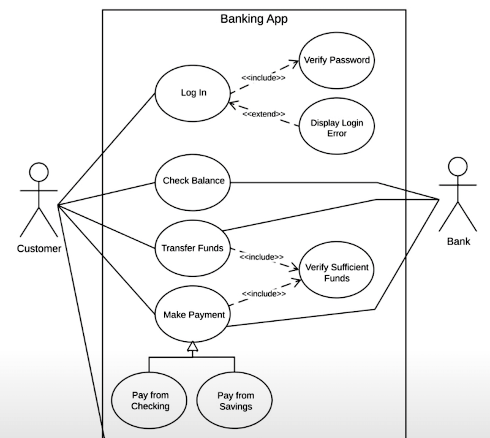

# Use Case

- Systems
- Actors
- Use Cases
- Relationships

## Systems

## Actors

- Primary Actors : Initiate the use of the system
- Secondary Actors : Reactionary

## Use Cases

## Relationships

### Association

### Include

`Base Use Case` always include `Include Use Case`

Example:

```
(Log in)---<<include>>-->(Verify Password)
```

### Extend

`Base Use Case` sometimes extend `Extend Use Case`

Example:

```
(Log in)<--<<extend>>---(Display Error)
```

### Generalization

Inheritance

`Parent Use Case` to `Child Use Case`

Example:

```
(Make Payment)<----------(Pay from Checking)

(Make Payment)<----------(Pay from Savings)
```

## Example



## References

- [UML Use Case Diagram Tutorial](https://www.youtube.com/watch?v=zid-MVo7M-E)
